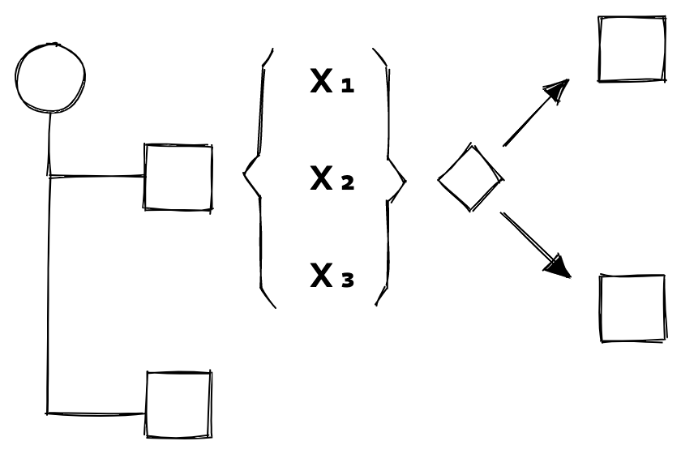

# JFlow



## Run

```bash
git clone git@github.com:jererobles/jflow.git
cd jflow
yarn install
npx ts-node index.ts
```

## To Do

-   [x] define execution flow
    1. workflow start
    2. all blocks on the top level are executed in parallel
    3. for each block, all their expressions are computed in parallel
    4. after all expressions in a block are computed, if:
       a. the subsequent step is a block, then the block is executed
       b. the subsequent step is a fork, then the fork is evaluated
    5. (3) and (4) are repeated until all blocks are executed
    6. workflow end
-   [x] define meta language
-   [x] define states
    1. pending
    2. running
    3. completed (success, skipped, failed)
    4. cancelled
-   [x] write models
-   [x] write parser
-   [x] write runner
-   [ ] query execution state
-   [ ] build basic UI
-   [x] implement basic block types
-   [x] first manual e2e test
-   [x] fixme: having both enums and classes for types is silly
